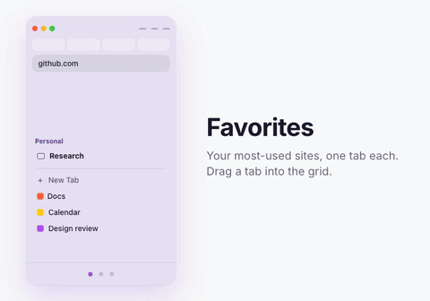
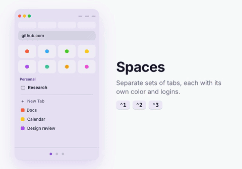
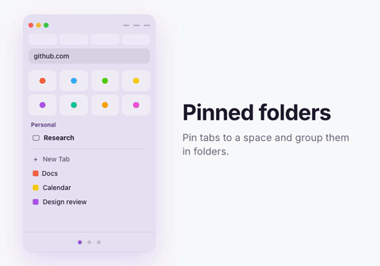
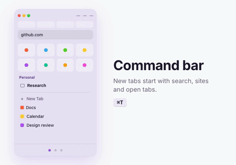
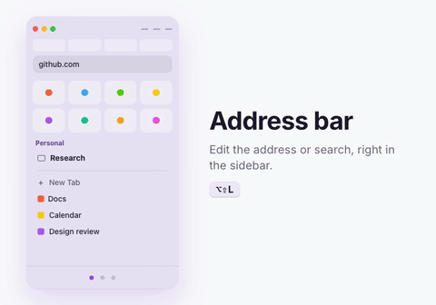
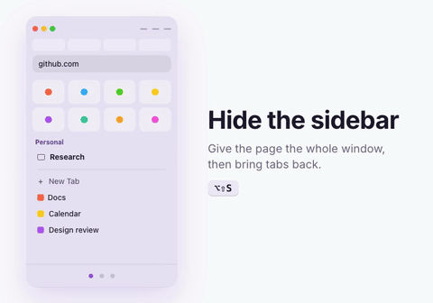
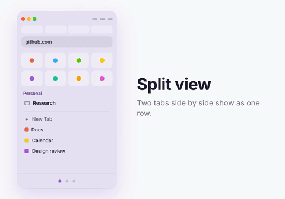
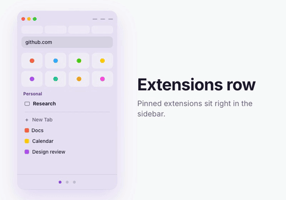

<p align="center">
  
</p>

<h1 align="center">Arc for Firefox</h1>

<p align="center">An Arc-style sidebar for Firefox: favorites, spaces, pinned tabs and folders, a command bar for new tabs, and an address bar in the sidebar.</p>

With a small one-time setup it replaces Firefox's tab strip and toolbar, so the sidebar and the page get the whole window.

> Not affiliated with or endorsed by The Browser Company. “Arc” is their browser; this is an independent extension that brings its sidebar ideas to Firefox.

## Features

<table>
  <tr>
    <td width="50%" valign="top">
      <br>
      <b>Favorites</b><br>
      A grid of icons at the top. Each favorite owns one tab: click to switch to it, or reopen it if you closed it. Favorites belong to a container, like Arc's per-profile favorites.
    </td>
    <td width="50%" valign="top">
      <br>
      <b>Spaces</b><br>
      Separate sets of tabs with their own name, emoji and color. Switch from the footer, with a two-finger swipe, or <code>⌃1</code>–<code>⌃5</code> (<code>Alt+Shift+1</code>–<code>5</code>). A space can use its own Firefox container, so it keeps separate logins.
    </td>
  </tr>
  <tr>
    <td width="50%" valign="top">
      <br>
      <b>Pinned tabs and folders</b><br>
      Pin tabs to a space; they stay when closed. Shift- or Command-click to select several, right-click → <i>New Folder</i>. The pinned section folds away under the space name.
    </td>
    <td width="50%" valign="top">
      <br>
      <b>Command bar</b><br>
      <code>⌘T</code> / <code>Ctrl+T</code> opens a search box instead of a blank page: addresses, searches, open tabs, history.
    </td>
  </tr>
  <tr>
    <td width="50%" valign="top">
      <br>
      <b>Address bar in the sidebar</b><br>
      Shows the site you're on; click to edit or search. <code>⌥⇧L</code> / <code>Alt+Shift+L</code>.
    </td>
    <td width="50%" valign="top">
      <br>
      <b>Hide the sidebar</b><br>
      <code>⌥⇧S</code> / <code>Alt+Shift+S</code> gives the page the whole window. Press it again to bring your tabs back.
    </td>
  </tr>
  <tr>
    <td width="50%" valign="top">
      <br>
      <b>Split view</b><br>
      Firefox's split tabs show as one row. Create and separate them with Firefox's own shortcuts (set them in <code>about:keyboard</code>).
    </td>
    <td width="50%" valign="top">
      <br>
      <b>Extensions row</b><br>
      Your pinned extensions sit in the sidebar, under the window buttons, once the layout setup is done.
    </td>
  </tr>
</table>

**Import from Arc.** Brings over spaces, pinned tabs, folders and favorites. Each Arc profile becomes a Firefox container.

Shortcuts can be changed in `about:addons` → ⚙ → *Manage Extension Shortcuts*.

## Install

Arc for Firefox needs **Firefox 155 or newer** (desktop; Firefox for Android has no sidebar).

1. Download the latest signed `.xpi` from [Releases](https://github.com/trajche/arc/releases) and open it in Firefox. It updates itself from there (Firefox checks daily; `about:addons` → ⚙ → *Check for Updates* forces it).
2. **Give Arc the whole window** (hides Firefox's tab strip and toolbar). Run the setup for your system — it finds the Firefox profile with Arc and adds Arc's layout, keeping any customizations you already have:

   **macOS / Linux** (Terminal)
   ```sh
   curl -fsSL https://raw.githubusercontent.com/trajche/arc/main/extras/setup/arc-setup.txt | bash
   ```

   **Windows** (PowerShell)
   ```powershell
   irm https://raw.githubusercontent.com/trajche/arc/main/extras/setup/arc-setup.ps1 | iex
   ```

   Then quit Firefox and open it again. Run it again after updating Arc. To remove Arc's layout: add `| bash -s -- --uninstall` on macOS/Linux, or run `& ([scriptblock]::Create((irm <url>))) -Uninstall` on Windows. The scripts are [`arc-setup.txt`](extras/setup/arc-setup.txt) and [`arc-setup.ps1`](extras/setup/arc-setup.ps1) if you'd rather read and run them yourself.
3. Coming from Arc? Right-click the space name → **Import from Arc…**

The welcome page (opened on install, or right-click the space name → *Welcome & Setup*) explains the features and offers the setup script.

### What the setup changes

- `<profile>/chrome/userChrome.css` hides the tab strip, Firefox's sidebar launcher and panel header, and turns the toolbar into a row of extension buttons in the sidebar. Firefox's own address bar appears as a centered overlay with `⌘L` / `Ctrl+L` (needed for `about:` pages, which extensions can't open).
- `<profile>/user.js` enables `userChrome.css`, horizontal tabs and session restore, keeps the window open when the last tab closes, and opens Arc's sidebar at startup.
- `<profile>/customKeys.json` clears Firefox's built-in *New tab* and *Close tab* shortcuts. They're reserved keys, so Arc can only take `⌘T` / `Ctrl+T` (command bar) and `⌘W` / `Ctrl+W` (close tab, but a space keeps its last command bar instead of emptying) once they're cleared; any other shortcuts you've customized are kept. Undo it in `about:keyboard`.

## Limits

Firefox doesn't allow extensions to do these:

- Draw over the page. Arc's floating command bar becomes a tab here.
- Open `about:` pages, create split views, or read Arc's saved logins and cookies.
- Switch browser profiles. Containers stand in for Arc profiles: separate cookies and logins, but shared history, bookmarks and extensions.

Spaces, pins and favorites are stored locally; Firefox Sync's extension storage is too small for large Arc imports.

## Development

```sh
npm install
npm run setup-dev   # once: creates the "arc-dev" Firefox Developer Edition profile
npm run dev         # start Developer Edition with that profile (macOS)
npm run reload      # reload Arc in place after changing code
npm run lint
```

The dev profile loads Arc unsigned, straight from this folder, and links `extras/userChrome.css` into the profile. Code changes need `npm run reload`; `userChrome.css` changes need a Developer Edition restart. Release Firefox only runs signed add-ons.

- `npm run build:setup` regenerates `extras/setup/` from `extras/userChrome.css` and `extras/user.js`. Run it after changing either.
- `npm run build:gifs` re-renders the feature animations (HyperFrames project in `videos/arc-feature-loops`) and slices them into `docs/features/`.
- `npm run sign` bumps the version and signs an unlisted build with addons.mozilla.org. It reads `WEB_EXT_API_KEY` / `WEB_EXT_API_SECRET` from `.env` (git-ignored).
- `npm run release` signs a build, publishes it as a GitHub release, and points `updates.json` at it so installed copies update themselves. Needs the `gh` CLI and a clean git tree.

| Path | What |
|---|---|
| `background.js` | Tab lifecycle, spaces, context menus, commands |
| `shared/store.js` | Data: spaces, favorites, pinned items, folders, import |
| `sidebar/` | The sidebar: tabs, address bar, spaces footer |
| `palette/`, `newtab/` | Command bar and the new-tab page that opens it |
| `editor/` | Space editor window (emoji data in `emoji.json`) |
| `import/` | Import from Arc (`arc-parse.js` reads Arc's `StorableSidebar.json`) |
| `welcome/` | Welcome and setup page |
| `extras/` | `userChrome.css`, `user.js` and the generated setup scripts |
| `scripts/` | Dev tooling: setup-script generator, dev profile, reload |

## License

[MIT](LICENSE). Emoji data from [unicode-emoji-json](https://github.com/muan/unicode-emoji-json) and [emojilib](https://github.com/muan/emojilib) (MIT, see [`editor/emoji.LICENSE.txt`](editor/emoji.LICENSE.txt)).
